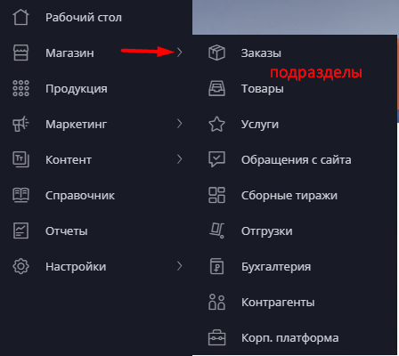

# Панель главного меню

## Левое меню

На рабочем столе слева находятся иконки главного меню. &#x20;

При наведении курсора мыши, открываются все разделы: Рабочий стол, Магазин, Продукция, Маркетинг, Контент, Справочник, Отчеты и Настройки. Через указанные разделы можно перейти в подразделы.

&#x20; &#x20;

## Краткое описание разделов

### Магазин

Раздел, полностью администрирующий процесс движения заказов: от обращений с сайта до заказов, тиражей, закрывающих документов и актов сверки. Содержит все данные по контрагентам: Клиенты/Покупатели/Плательщики/Группы/Корпоративные кабинеты клиентов.


[ecommerce](../ecommerce/)


### Продукция

В данном разделе группируется, создается, редактируется и удаляется вся продукция (в т.ч. [калькуляция продукции](../product/produkty/vkladka-kalkulyaciya/)), как отображаемая на сайте, так и находящаяся в процессе создания калькуляции.


[product](../product/)


### Маркетинг

Здесь вы можете создать [скидки](../marketing/skidki.md), реферальные программы, промокоды, оформить [скидочный баннер](../marketing/skidochnyi-banner.md) на сайте, а также произвести корректировку цен.


[marketing](../marketing/)


### Контент

Раздел, отвечающий за визуальное наполнение сайта, в данном разделе создаются новые страницы сайта, корректируется меню, новости, галереи изображений и другое.

В подразделе [Виджеты](../content/vidzhety/) вы можете создать следующие виджеты: [Таймер](/broken/pages/-M6o47kDkX75-JmoW1xk), [Рекомендуемые продукты](/broken/pages/-M6o47_gbdJbAlz1ry8w), [Галерея](/broken/pages/-M6o47vkaOka7f4O0SPQ), [Каталог товаров](/broken/pages/-M6o47NwVkxzTp4yuZZn), [Новости/Блог,](/broken/pages/-M6o48BvhMl-1a08ITg5) Сувенирная продукция —  Проект 111 и  Happy Gifts (в случае, если подключены данные модули). Подраздел [SEO](../content/seo/) содержит инструменты для продвижения сайта: 301 редирект, Канонические ссылки, Карта сайта Sitemap, Файл robots.txt, Мета-тэги.


[content](../content/)


### Справочник

В этом разделе создаются, редактируются, удаляются и группируются все составляющие калькуляции продукта: Материалы, Операции, Доп. операции, Комплектующие, Товары, Свойства, Упаковка, Продукция.&#x20;


[handbook](../handbook/)


### Отчёты

Здесь вы можете сформировать отчет по клиентам, плательщикам, заказам, товарам, обращениям с сайта, отгрузкам, коммерческим предложениям и мотивации менеджеров и т.д.


[reports.md](../reports.md)


### Настройки

В данном разделе вы можете управлять настройками Пользователей, Статусов, Доставки, Оплаты, Сайта, а также  интегрироваться с транспортными компаниями, платежными системами и другими сервисами (Интеграции).

В подразделе Другие настройки вы можете внести контактные данные ([Контактные данные](../settings/drugie-nastroiki/kontaktnye-dannye.md)), настроить почтовый сервер ([Настройка почтового сервера](../settings/drugie-nastroiki/nastroika-pochtovogo-servera.md)), сделать шаблоны e-mail-писем ([Шаблоны e-mail-писем](../settings/drugie-nastroiki/shablony-email-pisem.md)),  установить выходные и нерабочие дни в [Производственном календаре](../settings/drugie-nastroiki/proizvodstvennyi-kalendar.md), внести свои шаблоны в сроки производства ([Шаблонов сроков производства](../settings/drugie-nastroiki/shablony-srokov-proizvodstva.md)), сделать выгрузку на FTP сервер ([Настройка FTP сервера](../settings/drugie-nastroiki/nastroika-ftp-servera.md)), отрегулировать работу с макетом  в подразделе [Работа с макетом](../settings/drugie-nastroiki/rabota-s-maketom/), изменить шаблон информации в настройках калькуляции ([Настройка калькуляции](../settings/drugie-nastroiki/nastroika-kalkulyacii.md)).


[settings](../settings/)


