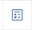

# Верхняя панель

.png>)

## **Логотип**

В левом верхнем углу отображается логотип компании. Кликнув на него, вы попадаете на главную страницу сайта (интернет-магазин).

.png>)

> Настройки → Сайт → Настройки сайта → Настройки логотипа&#x20;

## **Поиск**

В верхней панели также находится строка поиска, которая позволяет осуществлять поиск по:

* заказам;
* тиражам;
* клиентам;
* покупателям (ИП, ООО, ОАО, ...);
* продукции.

Из строки поиска вы можете перейти в нужный вам заказ, товар, продукт или в карточку контрагента.

.png>)

## **Мотивация менеджера**

В случае, если подключен модуль "Мотивация менеджеров", данные по показателям будут отображаться иконкой Смайлика: &#x20;

> Настройки → Пользователи → Мотивация менеджера

.png>)

Переход в настройку модуля:


[motivaciya-menedzherov.md](../settings/polzovateli-1/motivaciya-menedzherov.md)


## **Время и дата**

Нажав на иконку с временем и датой, можно настроить время и дату, выбрав нужный временной пояс:

.png>)

## Модуль TCS&#x20;

Справа от времени и даты находится Модуль TCS с  информацией о выбранном вами тарифе, ссылкой на договор-оферту, просмотром счетов и внутреннего баланса.&#x20;

Чтобы детализировать информацию, щелкните мышкой на _названии_ тарифа.

.png>)

Вы попадете в админ-панель с двумя разделами **Основное** и **Счета**.

.png>)

**Основное**

* Тарифный план → выбранный вами тарифный план и период (тарификация) → 3,6 или 12 месяцев.
* Баланс → отображает наличие денежных средств на внутреннем балансе типографии.&#x20;
* Email (п.10.2. Оферты wow2print.com/offer.pdf) → согласно пункту 10.2. Соглашения между участниками электронного взаимодействия оферты, информация будет иметь юридическую силу, только если она оправлена с указанной электронной почты.&#x20;
* Почтовый адрес (п.11.2. Оферты wow2print.com/offer.pdf) →  согласно пункту 11.2. любой документ, уведомление или сообщение в письменной форме будет иметь юридическую силу, если оно отправлено курьером или заказным письмом по адресу, указанному в данном поле.&#x20;

В случае, если Вам необходимо сменить Email и/или почтовый адрес, обратитесь в [службу технической поддержки](tekhnicheskaya-podderzhka.md).

&#x20;В разделе **Счета** вы можете просмотреть неоплаченные, оплаченные и аннулированные счета, а также скачать их или переслать по электронной почте.

.png>)

## **Язык**

Кнопка  позволяет выбрать язык, который будет использоваться в админ-панели  сайта.

## **Калькуляция**

Кнопка  обеспечивает  быстрый доступ в раздел "Калькуляции в админ-панели".

## **Уведомления**

Кнопка  показывает уведомления системы. Количество новых (непросмотренных) уведомлений выводится цифрами в красном кружке.&#x20;

> Настройки → Пользователи → Роли и доступы → Роль → Редактировать → Уведомления (в самом низу страницы)

Переключателями выбрать нужное. А также в личном профиле, пройдя по кнопке в верхней панели  → Настройки → Уведомления (переключателями выбрать нужное).

## Профиль

###

### Настройки

Также в настройках профиля вы можете выбрать стиль меню и фон админ-панели.&#x20;

###

### Мой профиль

А в разделе "Мой профиль" отредактировать свои данные (Email, имя, фамилия, отчество, телефон), сменить пароль и установить нерабочие дни. &#x20;

.png>)

## **Верхние кнопки быстрого доступа**

Чуть ниже, в верхней части рабочего стола, настроены кнопки быстрого доступа, отображающие количественные данные.

Кнопки ведут в:

* раздел Магазин → Заказы (постоянная кнопка);
* раздел Магазин → Сборные тиражи, в случае, если подключен "Модуль — Сборные тиражи";
* раздел Магазин → Отгрузки, в случае, если подключен "Модуль — Отгрузки".

.png>)

Переход в настройки модулей:


[sbornye-tirazhi.md](../ecommerce/sbornye-tirazhi.md)



[otgruzki.md](../ecommerce/otgruzki.md)


&#x20;

При отключенном "Модуле — Сборные тиражи" и "Модуле — Отгрузки", по умолчанию, будут отображаться раздел Клиенты:

> Магазин → Контрагенты → Клиенты

и  Модуль "Скидки":

> Маркетинг → Скидки

.png>)

