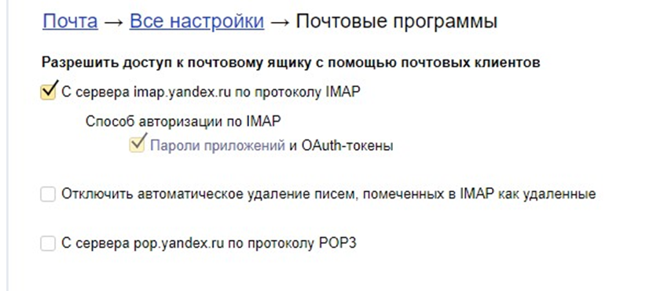
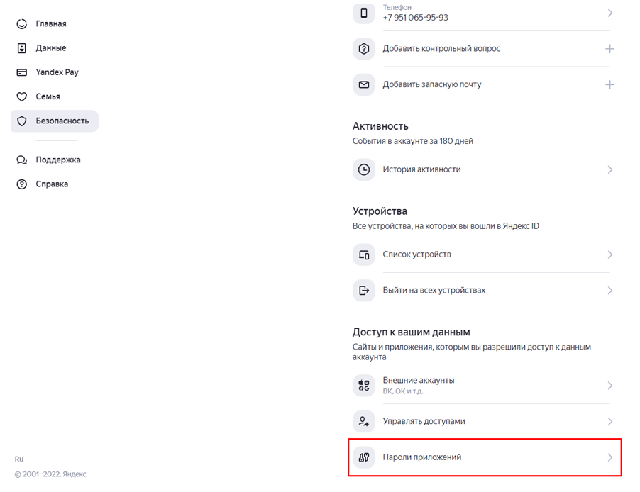
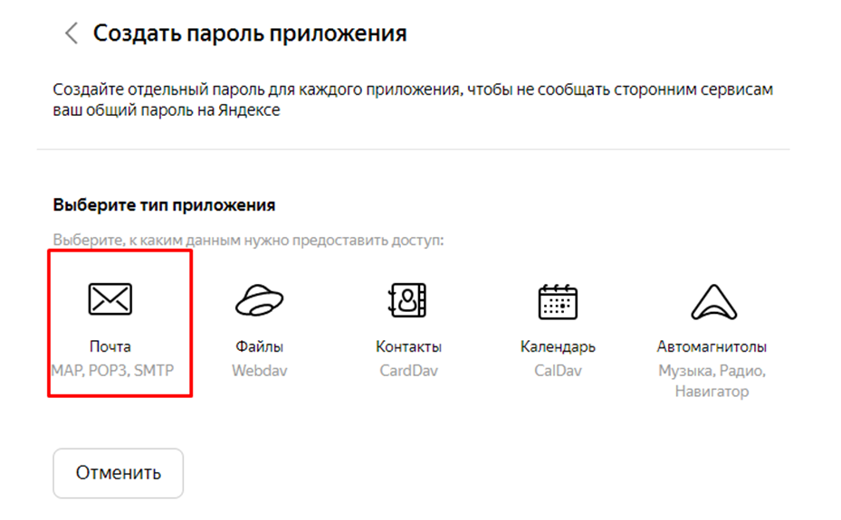
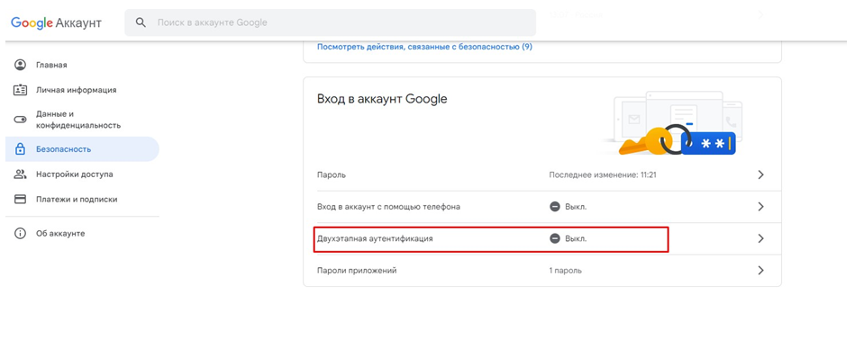
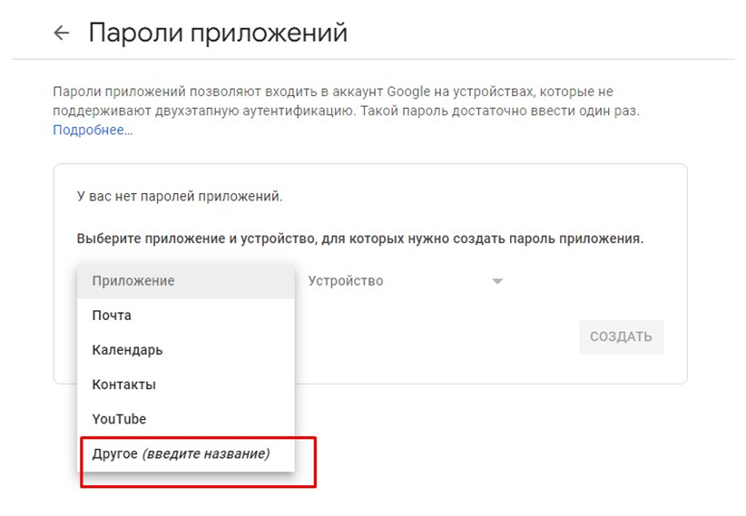
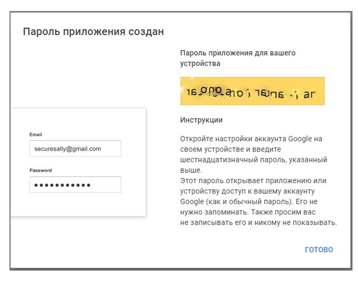
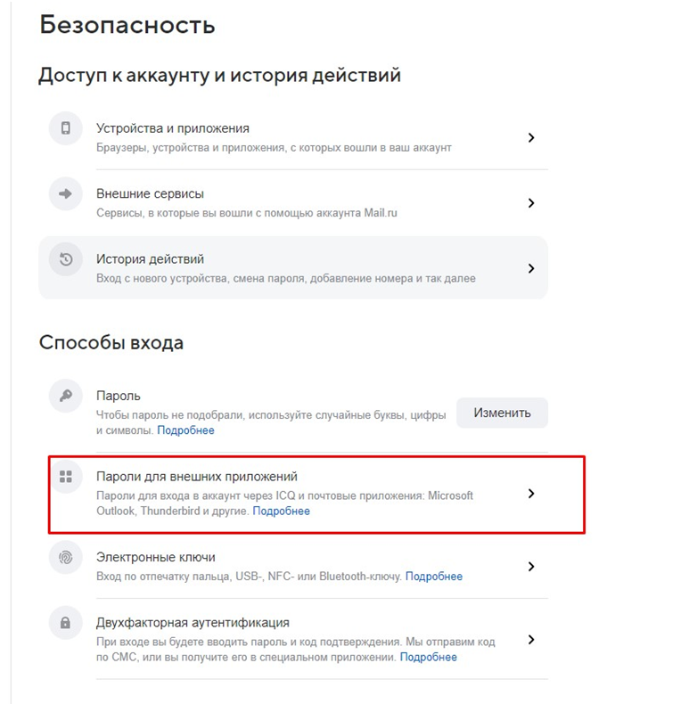

# Настройка почтового сервера

Почтовый сервер предназначен для автоматической отправки писем клиентам, таких как Письмо о регистрации, Письмо с уведомлением о смене статуса заказа, Письмо о сгорании бонусов и так далее.

## Общие настройки

.png>)

Чтобы настроить почтовый сервер, необходимо выполнить следующие действия:

*   Выбрать сервер по умолчанию, в зависимости от вашей почты: **smtp.yandex.ru,**&#x20;

    **smtp.gmail.com, smtp.mail.ru, smtp.rambler.ru**

Если вы не нашли свой почтовый сервер в предложенном списке, выберите вариант «Другой  сервер» → в поле _Сервер_ впишите свой сервер → в поле _Порт_ впишите нужный порт своего сервера (зависит от настроек каждого сервера).


Для стандартных серверов (**smtp.yandex.ru, smtp.gmail.com, smtp.mail.ru, smtp.rambler.ru)** поля _Сервер_ и _Порт_ заполняются автоматически


* В поле _Пользователь_ вписать адрес электронной почты, с которой планируется отправка писем.
* В поле _Пароль_ внести пароль от почты, указанной выше
* В поле _Имя отправителя_ написать то имя, которое будет видно получателям ваших писем

Для проверки введенных данных отметьте галочкой пункт _**Отправить тестовое**_ _**письмо**_, затем сохраните настройки.

##

## Тестовое письмо не пришло (ошибка отправки тестового письма)


Еще раз проверьте правильность введенных данных.


Если тестовое письмо все еще не отправляется:

 

### Для почты от Yandex

Если почта на [mail.yandex.ru](https://mail.yandex.ru/) дополнительно выполните следующие действия:

#### Шаг 1&#x20;

1. Авторизуйтесь в своем почтовом аккаунте **mail.yandex** через браузер;
2. Перейдите по ссылке [https://mail.yandex.ru/?dpda=yes#setup/client](https://mail.yandex.ru/?dpda=yes#setup/client);
3. Выберите настройки как на рис. 1;
4. Отправьте тестовое письмо.

<figure><figcaption>
Рис. 1 - Настройка яндекс почты
</figcaption></figure>

 

#### Шаг 2 - С помощью пароля приложенийг

1. Авторизуйтесь в своем почтовом аккаунте **mail.yandex** через браузер;
2. Перейдите в Управление аккаунтом – Безопасность – Пароли приложений;

<figure><figcaption>
Рис. 2 - Создание пароля приложения
</figcaption></figure>

&#x20; 3\.   Нажмите «Включить пароли приложений», введите пароль от вашей почты и нажмите «Создать новый пароль»;

&#x20; 4\.   Выберите тип приложения «Почта»;

<figure><figcaption>
Рис. 3 - Создание пароля приложения в Yandex
</figcaption></figure>

&#x20; 5\.   Скопируйте появившийся пароль и вставьте его в поле _Пароль_ в настройках почтового сервера в админ-панели.&#x20;

Для проверки отправьте тестовое письмо.

### Для почты от Google

Если почта на [gmail ](https://www.google.com/intl/ru/gmail/about/)дополнительно выполните следующие действия:

1. Авторизуйтесь в своем почтовом аккаунте gmail через браузер;
2. Перейдите в управление аккаунтом - раздел Безопасность - Вход в аккаунт Google - включите двухэтапную аутентификацию;

<figure><figcaption>
Рис. 4 - Включение двухэтапной аутентификации
</figcaption></figure>

&#x20; 3\.   После подтверждения аккаунта (пароль, код) нажмите кнопку «Включить»;

&#x20; 4\.   Затем перейдите на [https://myaccount.google.com/apppasswords](https://myaccount.google.com/apppasswords) и создайте пароль приложения (в поле Приложение выбираем _Другое_) → Создать

<figure><figcaption>
Рис. 5 - Создание пароля приложения в Google
</figcaption></figure>

&#x20; 5\.   Введите название для пароля приложения и нажмите «Создать»;

&#x20; 6\.   После создания приложения, на экране появится 16-значный код. Скопируйте его  и  вставьте в почтовых настройках админ-панели в поле _Пароль_ и сохраните.

<figure><figcaption>
Рис. 6 - Готовый пароль приложения
</figcaption></figure>

 

### Для почты от Mail

Если почта на [mail.ru](https://mail.ru/) дополнительно выполните следующие действия:

1. Авторизуйтесь в своем почтовом аккаунте mail через браузер;
2. В правом верхнем углу нажмите на аккаунт, перейдите в раздел _Пароль и безопасность_ – _Пароли для внешних приложений_

<figure><figcaption>
Рис. 7 - Создание пароля приложения
</figcaption></figure>

&#x20; 3\.   Нажмите «Добавить», введите название приложение, нажмите «Продолжить».

&#x20; 4\.   После создания приложения на экране появится 20-значный код. Скопируйте его, вставьте в почтовых настройках админ-панели в поле _Пароль_ и сохраните.&#x20;

Не забудьте для проверки отправить тестовое письмо.

<figure><figcaption>
Рис. 8 - Готовый пароль приложения
</figcaption></figure>

##

## Настройка DKIM

**DKIM (DomainKeys Identified Mail)** – это стандарт защиты электронной почты. С помощью данной настройки можно предотвратить попадание ваших писем в папку Спам.

.png>)

 

### Приватный ключ

Получить приватный ключ можно на сайте: [https://dkimcore.org/tools/keys.html](https://dkimcore.org/tools/keys.html)

В поле _Domain name_ введите адрес вашего сайта и нажмите на _Generate_

.png>)

 

### Настройка на сайте

В настройках почтового сервера в поле Приватный ключ необходимо вставить Privat key (вся выделенная область на скриншоте)

В поле _Идентификатор_ — строку, где упоминается адрес вашего сайта (строка, выделенная на скриншоте)

Поле _Пароль_ оставить пустым


DKIM создается на доменное имя вашего сайта, если адрес сайта изменился, его необходимо сгенерировать заново

