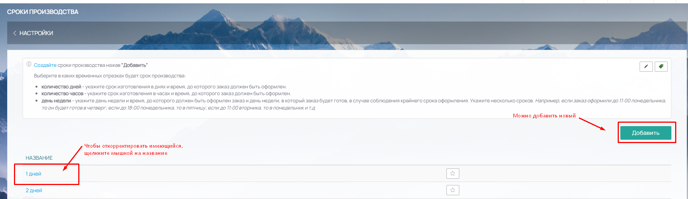
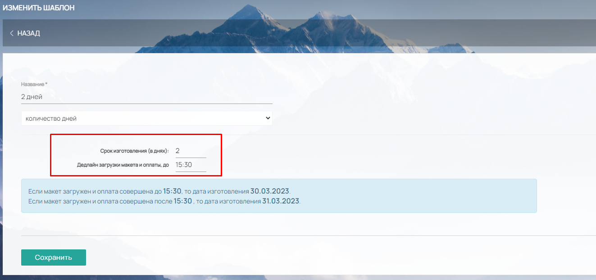
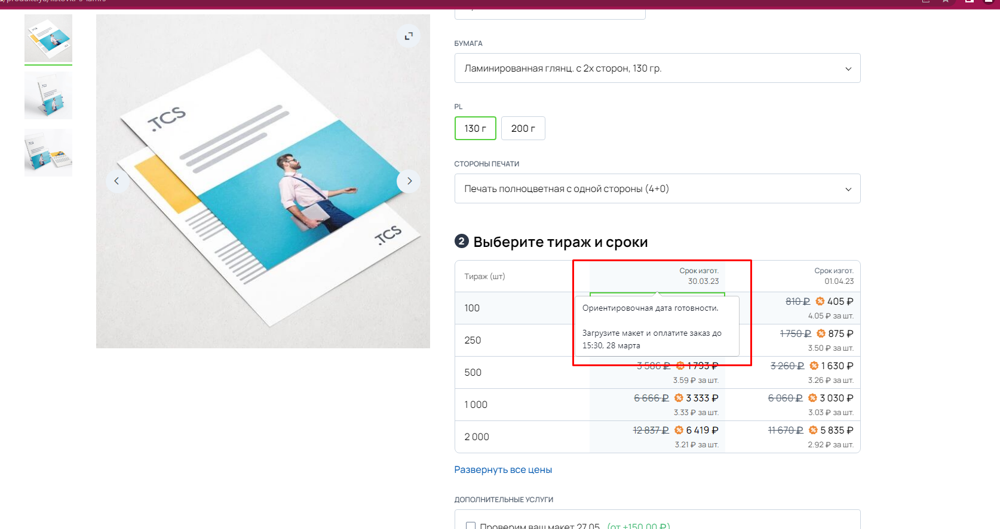
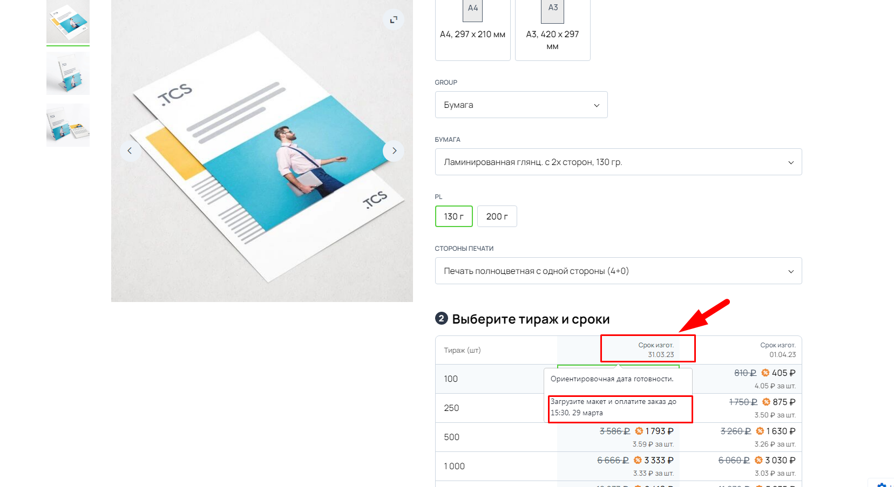
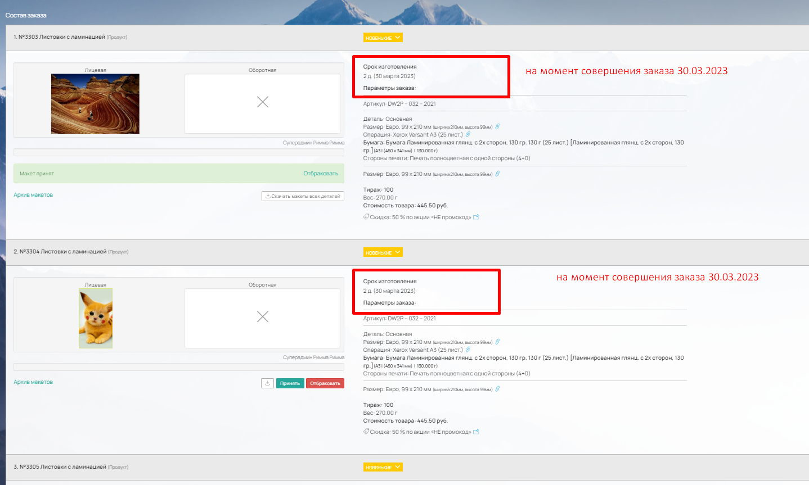
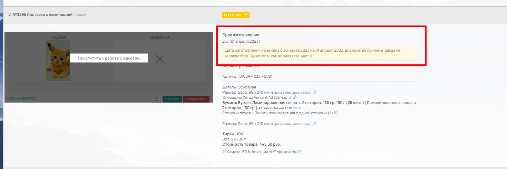
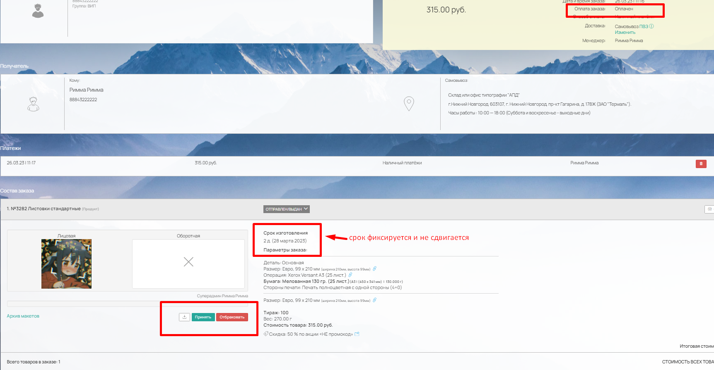

# Шаблоны сроков производства

Шаблон срока производства добавляется (настраивается) в&#x20;

> Админ-панель → Настройки → Другие настройки → Шаблоны сроков производства

<figure><figcaption></figcaption></figure>

Шаблоны сроков производства из данного раздела нужны для формирования "Сроков производства" в основных модулях калькуляции продукта.

<figure><figcaption></figcaption></figure>

### Добавление шаблона сроков производства

Чтобы добавить новый шаблон срока производства нажмите на кнопку "Добавить" в правом верхнем углу.

Отредактировать уже созданный срок можно щелкнув по нему мышкой.

<figure><figcaption></figcaption></figure>

В шаблоне указывается непосредственно срок изготовления в вариантах: количество дней/количество часов/день недели.

При выборе в шаблоне вариантов количество дней или количество часов, указанный срок будет учитывать выходные и праздничные дни, отмеченные в Производственном календаре (Настройки - Другие настройки - Производственный календарь). При выборе день недели, производственный календарь учитываться не будет.

При выборе в шаблоне срока изготовления в днях дополнительно указывается дедлайн загрузки макета и оплаты заказа.&#x20;

_Пример шаблона срока производства:_

<figure><figcaption></figcaption></figure>

#### **Логика отображения на сайте:**&#x20;

Если макет не загружен до указанного дедлайна, то сроки изготовления в калькуляции продукта на сайте будет передвигаться на день вперед. 

_Пример:_&#x20;

Срок изготовления 2 дня, дедлайн загрузки макета и оплаты - до 15.30. До 15.30 на сайте в калькуляции продукта ориентировочный срок изготовления стоит 30.03.2023&#x20;

<figure><figcaption></figcaption></figure>

После 15.30 срок изготовления сдвигается на 1 день вперед

<figure><figcaption></figcaption></figure>

#### Логика в карточке заказа в админ-панели:

В карточке товара (в заказе) отображается дата срока изготовления товара на момент оформления заказа.

<figure><figcaption></figcaption></figure>


**Дата изготовления фиксируется** только при условии если **заказ оплачен/проставлена гарантия оплаты и макет принят.**



Во всех остальных случаях ( т.е. **если не соблюдены оба или одно из условий**), **дата изготовления переносится на 1 день.**


_Пример на скрине:_ у заказа стоит гарантия оплаты (т.е. выполнено условие наличие оплаты/гарантии оплаты), у товара 3306 макет принят → срок зафиксировался.

У товара 3307 макет был загружен и отбракован, т.е. условие принятия макета не выполнено → срок сдвинулся на 1 день.

<figure><figcaption></figcaption></figure>

> <mark style="color:red;">**ВАЖНО!**</mark> Проверка на выполнение условий наличия оплаты/гарантии оплаты и принятия макета - каждый час (10.00, 11.00, 12.00 и т.д.), т.е. если дедлайн в шаблоне срока производства стоит 15.30, то перенос срока отобразится после 16.00.

Если срок изготовления товара перенесен, в ЛКК и в карточке товара в админ-панели появляется уведомление:

<figure><figcaption></figcaption></figure>

Если товар имеет последний статус ("Завершен") даже если он не оплачен и макет не принят, срок также фиксируется и не передвигается дальше.

_Пример на скрине:_ заказ оплачен, но макет не принят, но поскольку статус товара последний (завершающий), то срок изготовления не переносится.

<figure><figcaption></figcaption></figure>
