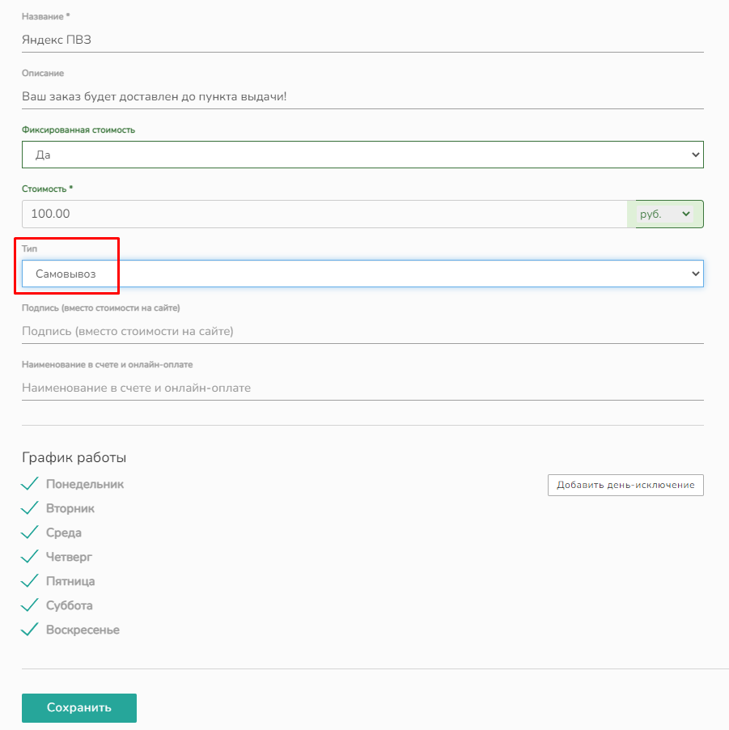

# Настраиваемая доставка

## Добавление новой настраиваемой доставки


В этом разделе вы узнаете как можно добавить свою доставку курьером и доставку до ПВЗ.&#x20;


Вы можете настроить свои индивидуальные способы доставок. Для этого выберите в

> Интеграции → Доставки → пункт Настраиваемые&#x20;

и нажмите "Подключить"

.png>)

В открывшейся форме укажите:

* &#x20;_Название_ настраиваемой интеграции
* _Тип выбора:_ город, регион, страна или почтовый индекс. В зависимости от типа выбора будут определяться зоны доставки: по городам, регионам, странам или интервалам индексов.
* _Валюту_, в которой будет считаться доставка
* При необходимости установите галочку _Резервная доставка_

<figure><figcaption></figcaption></figure>

После сохранения, вам откроются дополнительные вкладки: "Доставки", "ПВЗ" и "Цены"

<figure><figcaption></figcaption></figure>

### Вкладка Доставки

Во вкладке Доставки через кнопку "Добавить" внесите все необходимые доставки.&#x20;

<figure><figcaption></figcaption></figure>

После нажатия кнопки "Добавить" заполните _Название_ и _Описание_ (при необходимости) для  добавляемой доставки и нажмите "Сохранить".

<figure><figcaption></figcaption></figure>

Доставка появится в списке доставок. Не забудьте ее включить. Чтобы внести необходимые параметры для доставки нажмите кнопку "Редактировать"

<figure><figcaption></figcaption></figure>

&#x20;и  в открывшейся странице выберите:

* _Стоимость:_ фиксированная или нет. В случае выбора фиксированной, заполните поле Стоимость. Независимо от цен во вкладке Цены, доставка будет равна указанной сумме.
* _Тип:_ курьер
* _Подпись (вместо стоимости на сайте)_. Если вам нужно скрыть стоимость на сайте, в данном поле вы можете ввести любую подпись. Например, если доставка 0 руб., можно заменить 0 руб. на слово "Бесплатная"
* _Наименование в счете и онлайн-оплате_
* _График работы_

После внесения всех данных нажмите _Сохранить._

<figure><figcaption></figcaption></figure>

### **Вкладка Цены**

Чтобы добавить цены во вкладке Цены нужно:

&#x20;**1) добавить зону доставки** через соответствующую кнопку "Добавить зону" → ввести _название_ зоны и сохранить.

<figure><figcaption></figcaption></figure>

2\) через кнопку "Добавить города" **выбрать в поиске нужные города доставки**

<figure><figcaption></figcaption></figure>

Пример правильно добавленных городов (внизу должен отобразится выбранный город/субъект)

<figure><figcaption></figcaption></figure>

3\) Через кнопку "Добавить доставку" **прикрепить к зоне нужную доставку из списка**, указав количество дней на доставку.

<figure><figcaption></figcaption></figure>

4\) **заполнить цены** в зависимости от веса продукции. Вы можете добавить необходимое кол-во цен через кнопку "Добавить цену". **В случае, если у вас выбрана фиксированная цена, впишите в поля Вес, от (г)** → **Вес, до (г) необходимые значения, в поле Цена поставьте 0.**  Нажмите _Сохранить_.&#x20;

<figure><figcaption></figcaption></figure>

5\) Если у вас предусмотрено несколько вариантов доставки добавить дополнительные через кнопку "Добавить доставку". Например:

<figure><figcaption></figcaption></figure>

6\) Если у вас предусмотрено несколько зон доставки добавить нужные зоны через кнопку "Добавить зону". И добавляете города, доставки и цены так же как указано выше.

<figure><figcaption></figcaption></figure>

Чтобы активировать способ доставки, на забудьте включить настраиваемую интеграцию в общем списке интеграций. Проверьте, чтобы на сайте доставка была включена Настройки → Доставка → Доставка на сайте.

.png>)

<figure><figcaption></figcaption></figure>

**Пример на сайте:**

<figure><figcaption></figcaption></figure>

## Добавление новой настраиваемой доставки до ПВЗ

### Вкладка Доставки

Во вкладке Доставки через кнопку "Добавить" внесите необходимые доставки.

<figure><figcaption></figcaption></figure>

После нажатия кнопки "Добавить" заполните _Название_ и _Описание_ (при необходимости) для  добавляемой доставки и нажмите "Сохранить".

<figure><figcaption></figcaption></figure>

Доставка появится в списке доставок. Не забудьте ее включить. Чтобы внести необходимые параметры для доставки нажмите кнопку "Редактировать"

<figure><figcaption></figcaption></figure>

и в открывшейся странице выберите:

* _Стоимость:_ фиксированная или нет. В случае выбора фиксированной, заполните поле Стоимость. Независимо от цен во вкладке Цены, доставка будет равна указанной сумме.
* _Тип:_ самовывоз
* _Подпись (вместо стоимости на сайте)_. Если вам нужно скрыть стоимость на сайте, в данном поле вы можете ввести любую подпись. Например, если доставка 0 руб., можно заменить 0 руб. на слово "Бесплатная"
* _Наименование в счете и онлайн-оплате_
* _График работы_

После внесения всех данных нажмите _Сохранить._

<figure><figcaption></figcaption></figure>

### Вкладка ПВЗ

Добавьте адреса пунктов выдачи через кнопку "Добавить ПВЗ"

<figure><figcaption></figcaption></figure>

Выберите город и заполните поля: _Название, Адрес, Телефон, Широта, Долгота_. И нажмите кнопку Сохранить.&#x20;

<figure><figcaption></figcaption></figure>

Если планируете занести большое количество ПВЗ, вы можете загрузить таблицу со списком ПВЗ. Для этого нажмите на "Загрузить таблицу"

Таблица должна иметь следующий вид:

<figure><figcaption></figcaption></figure>

_id_ - это ID записи ПВЗ

Чтобы определить какой именно cityid у города, воспользуйтесь таблицей:



После внесения данных, вкладка ПВЗ будет выглядеть так. Вы можете выключить отображение ПВЗ, редактировать данные или удалить запись.

<figure><figcaption></figcaption></figure>

### Вкладка Цены

Вкладка цены заполняется также, как при создании доставки курьером [ссылка](nastraivaemaya-dostavka.md#vkladka-ceny).

В одной зоне можно использовать 2 доставки. Например, в "Зона 2" будет доставка курьером и доставка до ПВЗ.

<figure><figcaption></figcaption></figure>

**Пример на сайте:**

<figure><figcaption></figcaption></figure>
